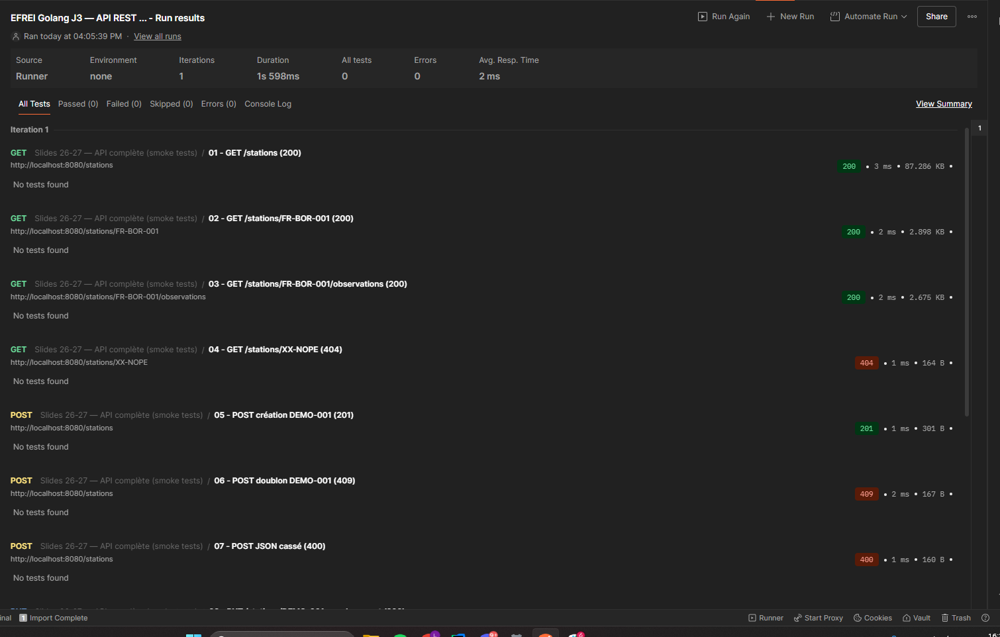
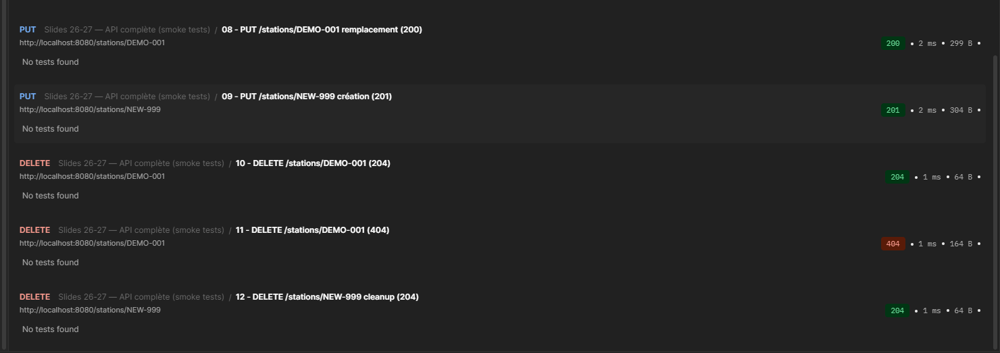

# TP J3 — API REST Météo

## Lancer le serveur

Depuis la racine du module :

```bash
go run ./tp2/
```

Le serveur démarre sur `http://localhost:8080`. Au démarrage, le terminal affiche :
```
bootstrap : 30 stations chargées
```

---

## Routes

| Méthode | Route | Statuts |
|---|---|---|
| GET | `/health` | 200 |
| GET | `/stations` | 200 |
| GET | `/stations/{id}` | 200, 404 |
| GET | `/stations/{id}/observations` | 200, 404 |
| POST | `/stations` | 201, 400, 409 |
| PUT | `/stations/{id}` | 200, 201, 400 |
| DELETE | `/stations/{id}` | 204, 404 |

---

## Collection Postman

Collection utilisée : `EFREI Golang J3 — API REST météo`

Variable de collection : `baseUrl = http://localhost:8080`

---

## Validation Runner Postman



